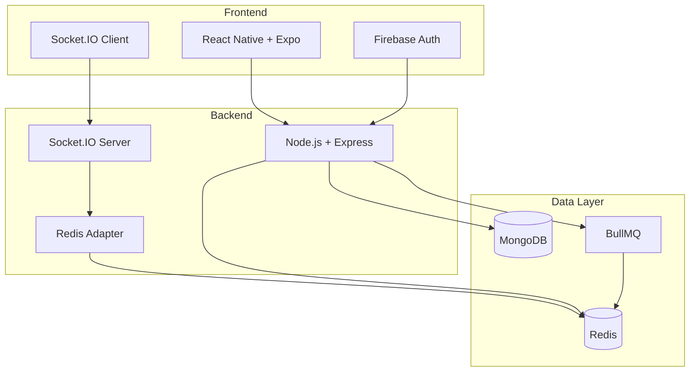

<div align="center">

# 💬 Bublizi

### Chat at Scale. Production-Ready from Day One.

<p align="center">
  
  
  
  
  
</p>

<p align="center">
  
  
  
  
  
</p>

<p align="center">
  <a href="#-features">Features</a> •
  <a href="#-quick-start">Quick Start</a> •
  <a href="#-architecture">Architecture</a> •
  <a href="#-documentation">Documentation</a> •
  <a href="#-deployment">Deployment</a>
</p>

---

**React Native + Node.js chat platform with real-time messaging, WebRTC voice/video calls, AI assistant, and distributed architecture supporting 100K+ concurrent users.**

</div>

---

## 🎯 Production Readiness

<table>
<tr>
<td align="center" width="25%">

<br/>
<sub><b>JWT Auth • Rate Limiting</b></sub>
<br/>
<sub>Brute Force Protection</sub>
</td>
<td align="center" width="25%">

<br/>
<sub><b>Connection Pooling</b></sub>
<br/>
<sub>Redis Caching • Indexing</sub>
</td>
<td align="center" width="25%">

<br/>
<sub><b>Distributed Systems</b></sub>
<br/>
<sub>Multi-Server Ready</sub>
</td>
<td align="center" width="25%">

<br/>
<sub><b>Load Balancer Ready</b></sub>
<br/>
<sub>Kubernetes Compatible</sub>
</td>
</tr>
</table>

### 📊 Scale Capacity

```
👥 100,000+  Total Users
🔌 10,000+   Concurrent Connections  
💬 1,000+    Messages per Second
```

---

## ✨ Features

<table>
<tr>
<td width="33%">

### 💬 Real-time Messaging
- Instant message delivery
- Typing indicators
- Read receipts
- Message reactions
- Pin important messages

</td>
<td width="33%">

### 📞 Voice & Video Calls
- WebRTC-based calling
- TURN relay support
- ICE negotiation
- Call renegotiation
- Call history tracking

</td>
<td width="33%">

### 🤖 AI Assistant
- Context-aware suggestions
- Cross-chat linking
- Smart replies
- Intent detection
- Conversation analysis

</td>
</tr>
<tr>
<td width="33%">

### 🎤 Voice Messages
- Record voice notes
- Inline playback
- Waveform visualization
- Audio compression
- Cloud storage

</td>
<td width="33%">

### 📁 File Sharing
- Image uploads
- File attachments
- Progress tracking
- Cloudinary CDN
- Thumbnail generation

</td>
<td width="33%">

### 📱 Contact Sync
- Phone contact discovery
- Automatic user matching
- Background sync
- Privacy controls
- Batch processing

</td>
</tr>
<tr>
<td width="33%">

### 🟢 Online Presence
- Real-time status
- Redis-backed
- Multi-server sync
- Heartbeat mechanism
- Last seen tracking

</td>
<td width="33%">

### 🔔 Push Notifications
- Firebase Cloud Messaging
- Background alerts
- Custom sounds
- Badge counts
- Deep linking

</td>
<td width="33%">

### 🔒 Security
- JWT authentication
- Input validation
- Rate limiting
- Audit logging
- CORS protection

</td>
</tr>
</table>

---

## 🏗️ Architecture

<div align="center">



</div>

### 🔧 Tech Stack

<table>
<tr>
<td width="50%">

#### Backend
- **Runtime:** Node.js 18+
- **Framework:** Express.js
- **Real-time:** Socket.IO + Redis Adapter
- **Database:** MongoDB (Connection Pooling)
- **Cache:** Redis (Sessions + Rate Limiting)
- **Queue:** BullMQ (Async Jobs)
- **Auth:** JWT (15min access + 30day refresh)
- **Storage:** Cloudinary (Media CDN)

</td>
<td width="50%">

#### Frontend
- **Framework:** React Native + Expo SDK
- **Navigation:** Expo Router
- **Auth:** Firebase Authentication
- **Real-time:** Socket.IO Client
- **State:** React Context + Hooks
- **Storage:** AsyncStorage
- **Media:** Expo AV + Image Picker
- **Notifications:** Firebase Cloud Messaging

</td>
</tr>
</table>

---

## 🚀 Quick Start

### Prerequisites

```bash
Node.js 18+  |  MongoDB  |  Redis  |  Expo CLI
```

### 1️⃣ Clone Repository

```bash
git clone https://github.com/suvankar11223/Bublizi.git
cd Bublizi
```

### 2️⃣ Backend Setup

```bash
cd backend
npm install
cp .env.example .env
# Edit .env with your configuration
npm run dev
```

<details>
<summary>📝 Environment Variables</summary>

```env
PORT=3000
MONGODB_URI=mongodb://localhost:27017/bublizi
REDIS_URL=redis://localhost:6379
JWT_SECRET=your-secret-key
JWT_REFRESH_SECRET=your-refresh-secret
FIREBASE_PROJECT_ID=your-project-id
CLOUDINARY_CLOUD_NAME=your-cloud-name
CLOUDINARY_API_KEY=your-api-key
CLOUDINARY_API_SECRET=your-api-secret
```

</details>

### 3️⃣ Frontend Setup

```bash
cd frontend
npm install
# Edit .env with your configuration
npx expo start
```

### 4️⃣ Run with Docker

```bash
docker-compose build
docker-compose up -d
```

---

## 🔐 Security Features

<div align="center">

| Feature | Implementation | Status |
|---------|---------------|--------|
| 🔑 Authentication | JWT + Refresh Tokens (15min/30day) | ✅ |
| 🛡️ Input Validation | Global middleware with sanitization | ✅ |
| 🚦 Rate Limiting | Redis-based distributed limiting | ✅ |
| 🚫 Brute Force Protection | IP blocking after 5 failed attempts | ✅ |
| 🔒 Password Policy | 8+ chars, complexity requirements | ✅ |
| 📝 Audit Logging | 90-day retention with event tracking | ✅ |
| 🌐 CORS Protection | Restricted origins and methods | ✅ |
| 🔐 WebRTC Auth | Signaling authentication required | ✅ |

</div>

---

## ⚡ Performance Optimizations

<table>
<tr>
<td width="50%">

### Database
- ✅ Connection pooling (50 prod / 10 dev)
- ✅ Indexed queries on all collections
- ✅ Batch operations for bulk updates
- ✅ Aggregation pipeline optimization
- ✅ Automatic connection recovery

</td>
<td width="50%">

### Caching
- ✅ Redis for session management
- ✅ Rate limit counters in Redis
- ✅ Presence data in Redis
- ✅ Queue jobs in Redis
- ✅ 30s Clerk token cache

</td>
</tr>
<tr>
<td width="50%">

### Real-time
- ✅ Socket.IO Redis adapter
- ✅ Multi-server synchronization
- ✅ Heartbeat mechanism (15s)
- ✅ Automatic reconnection
- ✅ Binary data support

</td>
<td width="50%">

### API
- ✅ Request timeout protection
- ✅ Smart timeout per route type
- ✅ Async job processing (BullMQ)
- ✅ Non-blocking AI operations
- ✅ Graceful error handling

</td>
</tr>
</table>

---

## 🏥 Health Monitoring

### Endpoints

```bash
GET /health   # Overall system health
GET /ready    # Readiness probe (load balancers)
GET /live     # Liveness probe (Kubernetes)
GET /stats    # Detailed runtime statistics
```

### Health Checks

- ✅ MongoDB connection & latency
- ✅ Redis connection & operations
- ✅ Queue system status
- ✅ Memory usage monitoring
- ✅ Dependency health tracking

---

## 📚 Documentation

<table>
<tr>
<td align="center" width="20%">
<a href="./PRODUCTION_READINESS_FINAL.md">

</a>
<br/>
<sub>Complete audit results</sub>
</td>
<td align="center" width="20%">
<a href="./FIREBASE_SETUP.md">

</a>
<br/>
<sub>Authentication guide</sub>
</td>
<td align="center" width="20%">
<a href="./PHASE_0_SECURITY_FOUNDATION_COMPLETE.md">

</a>
<br/>
<sub>Security foundation</sub>
</td>
<td align="center" width="20%">
<a href="./PHASE_1_COMPLETE.md">

</a>
<br/>
<sub>Performance tuning</sub>
</td>
<td align="center" width="20%">
<a href="./PHASE_2_COMPLETE.md">

</a>
<br/>
<sub>Multi-server setup</sub>
</td>
</tr>
<tr>
<td align="center" width="20%">
<a href="./PHASE_3_SECURITY_HARDENING.md">

</a>
<br/>
<sub>Security hardening</sub>
</td>
<td align="center" width="20%">
<a href="./PHASE_4_ARCHITECTURE_STABILITY.md">

</a>
<br/>
<sub>Architecture stability</sub>
</td>
<td align="center" width="20%">
<a href="./README.html">

</a>
<br/>
<sub>Beautiful UI version</sub>
</td>
<td align="center" width="20%">
<a href="./backend/tests/manual-test-guide.md">

</a>
<br/>
<sub>Manual testing</sub>
</td>
<td align="center" width="20%">
<a href="https://github.com/suvankar11223/Bublizi/issues">

</a>
<br/>
<sub>Report bugs</sub>
</td>
</tr>
</table>

---

## 🚢 Deployment

### Docker Deployment

```bash
# Build images
docker-compose build

# Start all services
docker-compose up -d

# View logs
docker-compose logs -f

# Stop services
docker-compose down
```

### Kubernetes Deployment

```yaml
# Apply configurations
kubectl apply -f k8s/

# Check deployment status
kubectl get pods
kubectl get services

# View logs
kubectl logs -f deployment/bublizi-backend
```

<details>
<summary>📦 Kubernetes Configuration Example</summary>

```yaml
apiVersion: apps/v1
kind: Deployment
metadata:
  name: bublizi-backend
spec:
  replicas: 3
  template:
    spec:
      containers:
      - name: backend
        image: bublizi/backend:latest
        ports:
        - containerPort: 3000
        
        livenessProbe:
          httpGet:
            path: /live
            port: 3000
          initialDelaySeconds: 30
          periodSeconds: 10
        
        readinessProbe:
          httpGet:
            path: /ready
            port: 3000
          initialDelaySeconds: 10
          periodSeconds: 5
        
        resources:
          requests:
            memory: "512Mi"
            cpu: "500m"
          limits:
            memory: "2Gi"
            cpu: "2000m"
```

</details>

### Load Balancer Configuration

```yaml
# AWS Application Load Balancer
health_check:
  path: /ready
  interval: 30
  timeout: 5
  healthy_threshold: 2
  unhealthy_threshold: 3
```

---

## 🧪 Testing

### Run Backend Tests

```bash
cd backend
npm test
```

### Load Testing

```bash
# Basic load test
node tests/load-test.js

# Enhanced load test
node tests/enhanced-load-test.js

# Production validation
npx tsx tests/production-validation.ts
```

### Phase Validation

```bash
# Validate Phase 0 (Security)
npx tsx tests/phase-0-validation.ts

# Validate Phase 1 (Performance)
npx tsx tests/phase-1-validation.ts

# Validate Phase 2 (Distributed)
npx tsx tests/phase-2-validation.ts

# Validate Phase 3 (Security Hardening)
npx tsx tests/phase-3-validation.ts

# Validate Phase 4 (Architecture)
npx tsx tests/phase-4-simple-test.ts
```

---

## 📱 Building for Production

### Android Build

```bash
cd frontend
eas build --platform android --profile production
```

### iOS Build

```bash
cd frontend
eas build --platform ios --profile production
```

### Web Build

```bash
cd frontend
npx expo export:web
```

---

## 🎨 Screenshots

<div align="center">

| Chat Interface | Voice Call | AI Assistant |
|:--------------:|:----------:|:------------:|
|  |  |  |

</div>

---

## 🛣️ Roadmap

- [x] Phase 0: Security Foundation
- [x] Phase 1: Performance Optimization
- [x] Phase 2: Distributed Systems
- [x] Phase 3: Security Hardening
- [x] Phase 4: Architecture Stability
- [ ] Phase 5: Advanced Features
  - [ ] End-to-end encryption
  - [ ] Group video calls
  - [ ] Screen sharing
  - [ ] Message translation
  - [ ] Advanced analytics

---

## 🤝 Contributing

Contributions are welcome! Please feel free to submit a Pull Request.

1. Fork the repository
2. Create your feature branch (`git checkout -b feature/AmazingFeature`)
3. Commit your changes (`git commit -m 'Add some AmazingFeature'`)
4. Push to the branch (`git push origin feature/AmazingFeature`)
5. Open a Pull Request

---

## 📄 License

This project is licensed under the MIT License - see the [LICENSE](LICENSE) file for details.

---

## 👥 Team

<div align="center">

Built with ❤️ by the Bublizi Team

<p>
  <a href="https://github.com/suvankar11223">
    
  </a>
</p>

</div>

---

## 📞 Support

<div align="center">

Need help? We're here for you!

<p>
  <a href="https://github.com/suvankar11223/Bublizi/issues">
    
  </a>
  <a href="https://github.com/suvankar11223/Bublizi/discussions">
    
  </a>
</p>

</div>

---

## ⭐ Star History

<div align="center">

[](https://star-history.com/#suvankar11223/Bublizi&Date)

</div>

---

<div align="center">

### 🚀 Ready for Production • Built to Scale • Designed for Success

**[View Live Demo](https://github.com/suvankar11223/Bublizi)** • **[Read Documentation](./PRODUCTION_READINESS_FINAL.md)** • **[Report Issues](https://github.com/suvankar11223/Bublizi/issues)**

---

Made with 💚 using React Native & Node.js

**Version 1.0.0** • **March 2026**

</div>
